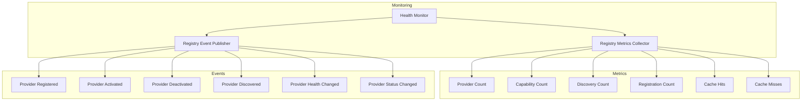

# Enterprise AI Provider Registry Monitoring

## Overview

Registry Monitoring provides observability into registry operations including metrics collection, event publishing, and health tracking.

## Monitoring Architecture

## Observable Metrics

| Metric | Description |
|--------|-------------|
| Provider Count | Total registered providers |
| Capability Count | Total indexed capabilities |
| Discovery Count | Total discovery events |
| Registration Count | Total registrations |
| Cache Hit Rate | Cache performance |

## Registry Events

| Event | Trigger |
|-------|---------|
| Provider Registered | New provider added to catalog |
| Provider Activated | Provider activated for use |
| Provider Deactivated | Provider deactivated |
| Provider Discovered | Provider found via discovery |
| Health Changed | Provider health status changed |
| Status Changed | Provider lifecycle status changed |
