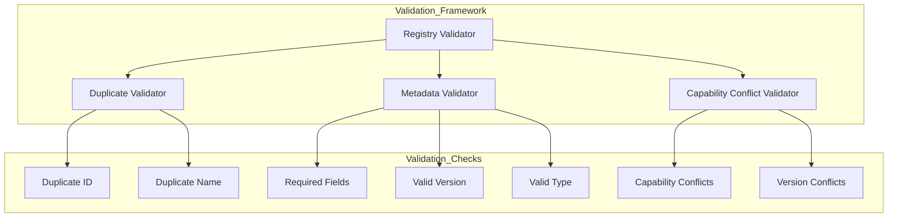
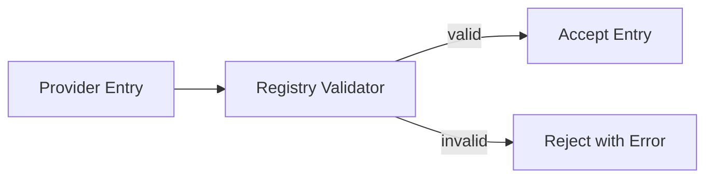

# Enterprise AI Provider Registry Validator

## Overview

The Registry Validation framework ensures that all provider registrations meet quality standards before being added to the catalog.

## Validation Architecture

## Validation Types

| Validator | Checks | Description |
|-----------|--------|-------------|
| DuplicateValidator | ID, Name | Detect duplicate providers |
| MetadataValidator | Fields, Version, Type | Validate metadata completeness |
| CapabilityConflictValidator | Capabilities, Versions | Detect capability/version conflicts |

## Validation Result

