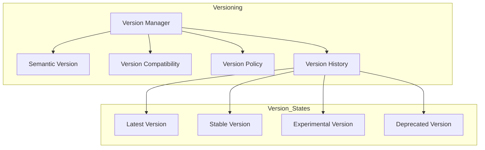
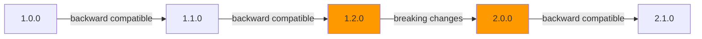

# Enterprise AI Provider Versioning Strategy

## Overview

The Versioning Strategy provides semantic version management for AI providers, ensuring compatibility tracking and smooth upgrade paths.

## Version Architecture



## Semantic Version Format

```
MAJOR.MINOR.PATCH-PRE_RELEASE+BUILD_METADATA

Example: 1.2.3-beta.1+20240721
```

## Compatibility Matrix



## Version Manager Responsibilities

- Register provider versions
- Track version history
- Check version compatibility
- Support upgrade paths
- Support rollback paths
- Deprecate old versions
